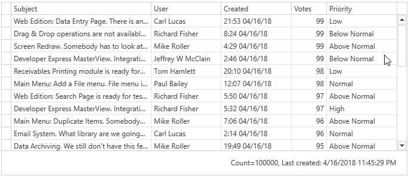

<!-- default badges list -->

<!-- default badges end -->
# WPF Data Grid - Bind to InfiniteAsyncSource
This example demonstrates how to bind the <a href="https://documentation.devexpress.com/WPF/DevExpress.Xpf.Grid.GridControl.class">GridControl</a> to <a href="https://documentation.devexpress.com/WPF/DevExpress.Xpf.Data.InfiniteAsyncSource.class">InfiniteAsyncSource</a>.

The solution in this example includes the following projects:

* **InfiniteAsyncSourceMVVMSample** - demonstrates the MVVM approach
* **InfiniteAsyncSourceSample** - demonstrates a basic non-MVVM approach

Refer to the <a href="https://documentation.devexpress.com/WPF/120194/Controls-and-Libraries/Data-Grid/Binding-to-Data/Binding-to-any-Data-Source-with-Virtual-Sources/How-to-Bind-to-Virtual-Source">How to Bind to Virtual Source</a> tutorial to learn more.

 

## More Examples

The following example shows how to bind the WPF Data Grid to different data sources: [Bind the WPF Data Grid to Data](https://github.com/DevExpress-Examples/how-to-bind-wpf-grid-to-data).

This example includes multiple solutions that demonstrate:
* How to bind the Data Grid to Entity Framework, EF Core, and XPO.
* Different binding mechanisms: virtual sources, server mode sources, and local data.
* MVVM and code-behind patterns.

After you bind the Data Grid to a database, you can implement CRUD operations (create, read update, delete). View the example: [Implement CRUD Operations in the WPF Data Grid](https://github.com/DevExpress-Examples/how-to-implement-crud-operations).
